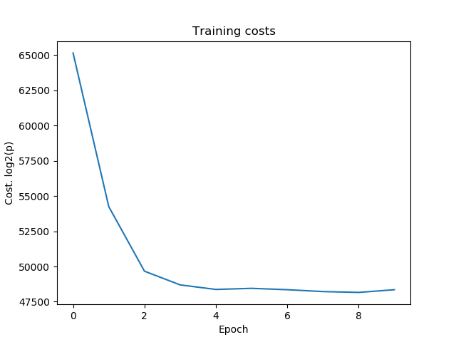

# hidden_markov_models

Study case of a Hidden Markov Model for continuous data. The model is created in Tensorflow

Data is generated using a trasition matrix:

    A = np.array([
        [0.9, 0.025, 0.025, 0.025, 0.025],
        [0.025, 0.9, 0.025, 0.025, 0.025],
        [0.025, 0.025, 0.9, 0.025, 0.025],
        [0.025, 0.025, 0.025, 0.9, 0.025],
        [0.025, 0.025, 0.025, 0.025, 0.9],
    ])

The mixture components:

    R = np.ones((M, K)) / K

The mu locations:

    mu = np.array([
        [[0, 0], [1, 1], [2, 2]],
        [[5, 5], [6, 6], [7, 7]],
        [[10, 10], [11, 11], [12, 12]],
        [[15, 15], [16, 16], [17, 17]],
        [[20, 20], [21, 21], [22, 22]],
    ])
    
And the covariance matrices:

    sigma[m, k] = np.identity(D)

The tensorflow model follows the scaled version of Forward Algorithm for HMM to support long sequences.

To calculate B we just sum over all k states of 

    R[j, k]*likelihood(x(t) | mu[j, k], sigma[j, k])
 
The backward algorithm and the Baum-Welch are not used as the loss can be calculated directy with the negative of the log probability of a sequence.

To calculate the alpha matrix we use the tensorflow scan operator to create a recurrent function.

    def recursion(old_a_old_c, t):
         at = tf.matmul(old_a_old_c[0], A_softmax) * B_tf[:, t]
         c = tf.reduce_sum(at)
         at/=c;
         return (at, c)

The cost of a sample is calculated as the log of that sequence probability. We use the log 
because as the sequence length gets larger the probability becomes close to zero creating an underflow problem.

    cost = -tf.reduce_sum(tf.log(cs)/tf.log(2.0))
    
We can then use gradient descent or another optimization algorithm to update the matrices.

    opt_step = tf.train.AdamOptimizer(learning_rate = 0.01).minimize(cost)

After the test data is generated, the HMM is trained and the training costs are plotted.

